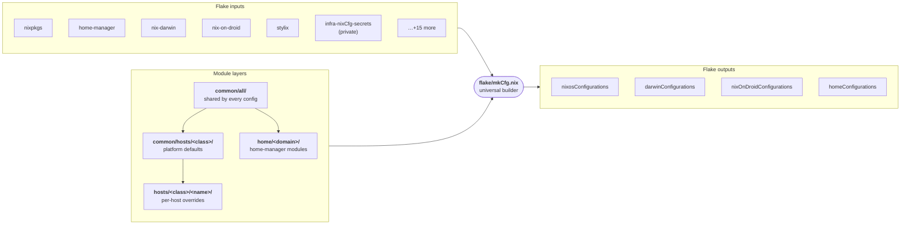
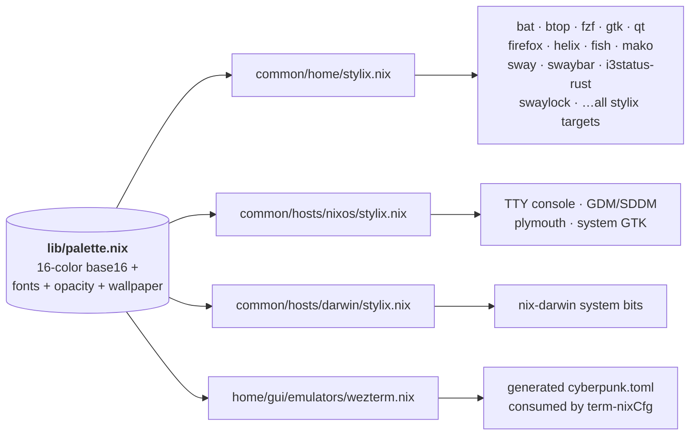

<div id="top">
    <div align="center">
        
        <h1 align='center'>infra-nixCfg</h1>
        <strong>My personal declarative Nix configurations for macOS, Android, and Linux (NixOS/WSL).</strong>
    </div>

</div>

---

<div align='center'>
    <a href="https://github.com/DivitMittal/infra-nixCfg/stargazers">
        
    </a>
    <a href="https://github.com/DivitMittal/infra-nixCfg/">
        
    </a>
    <a href="https://github.com/DivitMittal/infra-nixCfg/blob/main/LICENSE">
        
    </a>
    <a href="https://github.com/nixos/nixpkgs">
        
    </a>
    
</div>

---

<div align='center'>
    <a href="https://github.com/DivitMittal/infra-nixCfg/actions/workflows/flake-check.yml">
        
    </a>
    <a href="https://github.com/DivitMittal/infra-nixCfg/actions/workflows/home-build.yml">
        
    </a>
    <a href="https://github.com/DivitMittal/infra-nixCfg/actions/workflows/darwin-build.yml">
        
    </a>
    <a href="https://github.com/DivitMittal/infra-nixCfg/actions/workflows/nixos-build.yml">
        
    </a>
</div>

---

## Contents

- [Overview](#overview)
- [Quick Start](#quick-start)
- [Architecture](#architecture)
- [Project Structure](#project-structure)
- [Theme Pipeline](#theme-pipeline)
- [Home Manager Profile Graph](#home-manager-profile-graph)
- [Network Topology](#network-topology)
- [Secrets Management](#secrets-management)
- [Satellite Repositories](#satellite-repositories)

---

## Overview

This repository contains primarily [nix](https://github.com/nixos/nix) configurations, leveraging [Nix Flakes](https://nixos.wiki/wiki/Flakes), [Home Manager](https://github.com/nix-community/home-manager), and system-specific modules ([NixOS](https://nixos.org/), [nix-darwin](https://github.com/LnL7/nix-darwin), [nix-on-droid](https://github.com/nix-community/nix-on-droid)) to achieve a purely declarative, reproducible, and consistent environment across multiple OSes on multiple hosts for multiple users:

- **macOS** (via `nix-darwin`)
- **Android** (via `nix-on-droid`)
- **\*nix (NixOS)** (including WSL via `NixOS-WSL`)

## Quick Start

Drop into a pre-built shell environment without cloning or installing anything:

| Command                                           | Environment                                                            | Platform   |
| ------------------------------------------------- | ---------------------------------------------------------------------- | ---------- |
| `nix run github:DivitMittal/infra-nixCfg#tty`     | Full TTY toolchain (shells, editors, multiplexers, VCS, file tools, …) | all        |
| `nix run github:DivitMittal/infra-nixCfg#desktop` | TTY + Wayland compositor stack (sway, swaybar, mako, …)                | Linux only |

Each command drops you into `$SHELL` with the environment's packages prepended to `PATH`. No activation, no home-manager switch — ephemeral by design.

> The TTY environment already includes the AI toolchain via [ai-nixCfg](https://github.com/DivitMittal/ai-nixCfg).
> For an AI-only shell use `nix run github:DivitMittal/ai-nixCfg#ai`.

---

## Architecture

Every host — NixOS, nix-darwin, nix-on-droid, ISO, or standalone home-manager — is built by a single universal function `mkCfg` (`flake/mkCfg.nix`). It dispatches by `class` to the right configuration builder, then composes a layered module bundle: universal defaults from `common/all/`, platform defaults from `common/hosts/<class>/`, host-specific overrides from `hosts/<class>/<name>/`, and (for home-manager configs) user-domain modules from `home/<domain>/`.



`mkCfg` is class-driven; each class picks a different system builder and a different slice of modules. See [`flake/README.md`](./flake/README.md) for the dispatch flowchart and [`common/README.md`](./common/README.md) for the override hierarchy.

---

## Project Structure

The repository is organized using [flake-parts](https://github.com/hercules-ci/flake-parts) for better modularity.

```
.
├── flake/      # flake-parts modules — mkCfg, devshells, checks, actions, topology
├── common/     # shared layers: all/, home/, hosts/{all,darwin,droid,iso,nixos}/
├── hosts/      # per-host overrides: darwin/L1, nixos/{L2,T2,WSL}, droid/M1, iso/
├── home/       # home-manager modules by domain: tty/ gui/ tools/ media/ comms/ dev/ web/
├── modules/    # reusable NixOS/HM/darwin modules
├── overlays/   # nixpkgs overlays (custom, customDarwin)
├── pkgs/       # derivations: custom/ and darwin/
├── lib/        # custom Nix utility functions (palette, scanPaths, …)
├── utils/      # rebuild wrapper scripts
├── templates/  # flake templates (vanilla)
├── assets/     # topology SVGs, wallpapers, profile graph
└── flake.nix   # entry point — inputs, nixConfig, flake-parts wiring
```

## Theme Pipeline

A single source-of-truth palette (`lib/palette.nix`) — pitch-black background, neon cyan/magenta accents, soft white-blue foreground — feeds every themed surface in the repo. Stylix consumes it at three layers (home-manager / NixOS / nix-darwin) and theming-aware modules pull from it directly.



See [`lib/README.md`](./lib/README.md) for the palette structure and how to retune it.

## Home Manager Profile Graph

This dependency graph visualizes the dependencies of the Home-Manager profile configuration:


## Network Topology

The network topology visualizations are automatically generated using [nix-topology](https://github.com/oddlama/nix-topology) and provide a comprehensive view of the infrastructure setup across all hosts and networks.

### Main Topology

Complete view of all nodes, networks, and their interconnections:


### Network View

Focused visualization of network segments and connectivity:


> **Note**: These topology diagrams are automatically built and updated via GitHub Actions whenever topology configurations.

## Secrets Management

Secrets (API keys, passwords, sensitive configurations) are managed via [agenix](https://github.com/ryantm/agenix) or specificaly [ragenix](https://github.com/yaxitech/ragenix).

1.  Secrets are encrypted using `ssh` keys. My public key is explicitly available to `ragenix`.
2.  The encrypted files reside in a **private** GitHub repository: `DivitMittal/infra-nixCfg-secrets`. This repository is referenced as a flake input.
3.  During the Nix build process, `agenix` decrypts these files using my private key.
4.  The decrypted files are placed in the Nix store & symlinked to their target locations.

⚠️ **Building this configuration requires access to the private `DivitMittal/infra-nixCfg-secrets` repo and the corresponding [age](https://github.com/FiloSottile/age) private `ssh` key.**

## Satellite Repositories

- [DivitMittal/ai-nixCfg](https://github.com/DivitMittal/ai-nixCfg): AI/LLM tool configurations extracted for modularity (CLI tools, cloud services, MCP servers, REPL configurations).
- [DivitMittal/quant-nixCfg](https://github.com/DivitMittal/quant-nixCfg): Experimental sandbox + Nix home-manager modules/packages for open-source algo trading and quant workflows.
- [DivitMittal/playbooks-4-windows](https://github.com/DivitMittal/playbooks-4-windows): Ansible IaC for the Windows 11 boot on the x86_64 MacBook (triple-boot partner of L1 & T2); manages Scoop/Winget/MSYS2 packages, registry, and dotfiles.
- `DivitMittal/infra-nixCfg-secrets`: (Private) Contains encrypted secrets managed by `agenix` & `ragenix`.
- [DivitMittal/Vim-Cfg](https://github.com/DivitMittal/Vim-Cfg): Pure lua standalone Neovim configuration, deployed via `nix4nvchad`.
- [DivitMittal/Emacs-Cfg](https://github.com/DivitMittal/Emacs-Cfg): An elisp doomemacs configuration, used as an input via `nix-doom-emacs-unstraightened`.
- [DivitMittal/TLTR](https://github.com/DivitMittal/TLTR): Cross-platform complex multi-layer keyboard layout tailored for programmers.
- [DivitMittal/hammerspoon-nix](https://github.com/DivitMittal/hammerspoon-nix): A nix home-manager module for hammerspoon & my hammerspoon lua configuration.
- [DivitMittal/firefox-nixCfg](https://github.com/DivitMittal/firefox-nixCfg): A personal nix home-manager module/configurations for firefox.
- [DivitMittal/tidalcycles-nix](https://github.com/DivitMittal/tidalcycles-nix): A nix flake for TidalCycles live coding environment.
- [DivitMittal/term-nixCfg](https://github.com/DivitMittal/term-nixCfg): Terminal emulator configuration.
- [DivitMittal/forge-tofu](https://github.com/DivitMittal/forge-tofu): Terraform configurations for managing the GitHub organization infrastructure.

<div align="right">

[![][back-to-top]](#top)

</div>

[back-to-top]: https://img.shields.io/badge/-BACK_TO_TOP-151515?style=flat-square&color=purple
